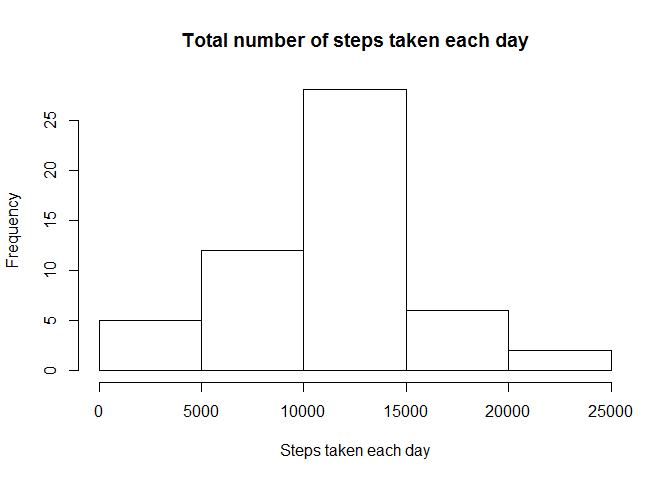
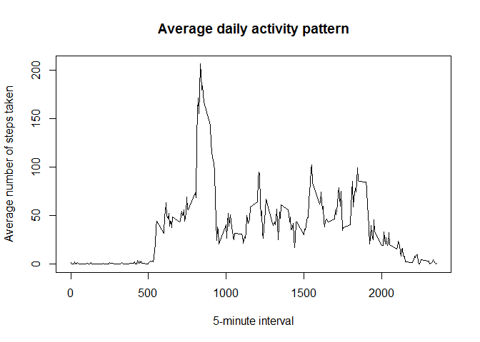
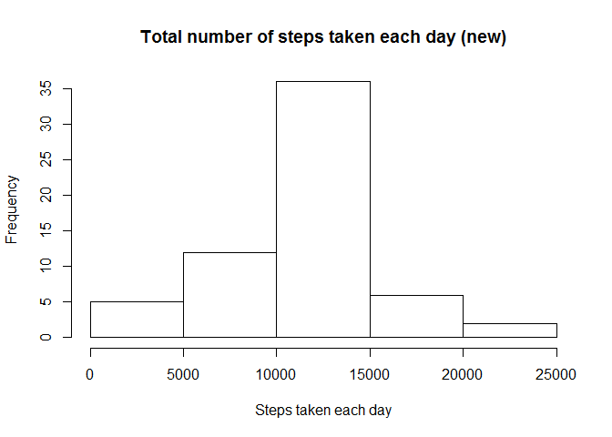

# Assignment

Load the data


```r
data <- read.csv("activity.csv")
```

#### What is mean total number of steps taken per day?

For this part of the assignment, you can ignore the missing values in the dataset.

1. Calculate the total number of steps taken per day.


```r
total_steps <- aggregate(steps ~ date, data, sum, na.action = na.omit)
```

2. Make a histogram of the total number of steps taken each day.


```r
hist(total_steps$steps, xlab = "Steps taken each day",
     main = "Total number of steps taken each day")
```

 

3. Calculate and report the mean and median of the total number of steps taken per day.

Mean


```r
mean(total_steps$steps)
```

```
## [1] 10766.19
```

Median


```r
median(total_steps$steps)
```

```
## [1] 10765
```

#### What is the average daily activity pattern?

1. Make a time series plot (i.e. type = "l") of the 5-minute interval (x-axis) and the average number of steps taken, averaged across all days (y-axis).


```r
mean_steps <- aggregate(steps ~ interval, data, mean, na.action = na.omit)
plot(mean_steps$interval, mean_steps$steps, type = "l",
     xlab = "5-minute interval", ylab = "Average number of steps taken",
     main = "Average daily activity pattern")
```

 

2. Which 5-minute interval, on average across all the days in the dataset, contains the maximum number of steps?


```r
max_steps <- which.max(mean_steps$steps)
mean_steps[max_steps, ]
```

```
##     interval    steps
## 104      835 206.1698
```

#### Imputing missing values

1. Calculate and report the total number of missing values in the dataset (i.e. the total number of rows with NAs).


```r
number_na <- summary(data$steps)[7]
number_na
```

```
## NA's 
## 2304
```

2. Devise a strategy for filling in all of the missing values in the dataset.

The mean for 5-minute interval will be utilized.

3. Create a new dataset that is equal to the original dataset but with the missing data filled in.


```r
new_data <- data
for (i in 1:nrow(data)) {
        if(is.na(data[i,"steps"])) {
                interval <- data[i,"interval"]
                index <- which(interval == mean_steps[,"interval"])
                new_data[i,"steps"] <- mean_steps[index, "steps"]
        }
}
head(new_data)
```

```
##       steps       date interval
## 1 1.7169811 2012-10-01        0
## 2 0.3396226 2012-10-01        5
## 3 0.1320755 2012-10-01       10
## 4 0.1509434 2012-10-01       15
## 5 0.0754717 2012-10-01       20
## 6 2.0943396 2012-10-01       25
```

4. Make a histogram of the total number of steps taken each day and calculate and report the mean and median total number of steps taken per day. Do these values differ from the estimates from the first part of the assignment? What is the impact of imputing missing data on the estimates of the total daily number of steps?


```r
new_total_steps <- aggregate(steps ~ date, new_data, sum)
hist(new_total_steps$steps, xlab = "Steps taken each day",
     main = "Total number of steps taken each day (new)")
```

 

Mean


```r
mean(new_total_steps$steps)
```

```
## [1] 10766.19
```

Median


```r
median(new_total_steps$steps)
```

```
## [1] 10766.19
```

The values do not differ from the estimates from the first part of the assignment. There is little impact of imputing missing data on the estimates of the total daily number of steps.

#### Are there differences in activity patterns between weekdays and weekends?

1. Create a new factor variable in the dataset with two levels - "weekday" and "weekend" indicating whether a given date is a weekday or weekend day.


```r
new_data$day <- weekdays(as.Date(new_data$date))
new_data$day[new_data$day %in% c("Monday", "Tuesday", "Wednesday", "Thursday", "Friday")] <- "Weekday"
new_data$day[new_data$day %in% c("Saturday", "Sunday")] <- "Weekend"
```

2. Make a panel plot containing a time series plot (i.e. type = "l") of the 5-minute interval (x-axis) and the average number of steps taken, averaged across all weekday days or weekend days (y-axis).


```r
steps_days <- aggregate(steps ~ interval + day, new_data, mean)
library(lattice)
xyplot(steps ~ interval | day, steps_days, layout = c(1, 2), type = "l",
       ylab = "Number of steps", xlab = "Interval")
```

 
